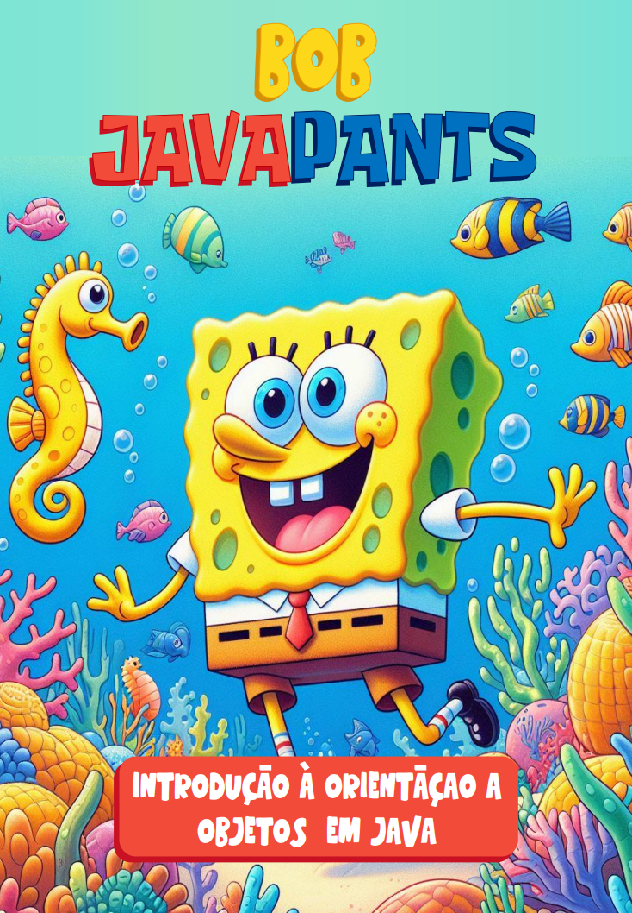

# 💛 Bob JavaPants: Introdução à Orientação a Objetos em Java

 

Esse repositório contém um e-book construído com a ajuda de inteligências artificiais (IAs). Todo o conteúdo gerado foi obtido por meio de prompts enviados a IAs e revisado por um humano.
## 📚 Sobre o eBook gerado

Neste livro digital, embarcaremos em uma jornada emocionante pelo universo da programação orientada a objetos (POO) em Java ao lado do personagem Bob Esponja. 

* **Capítulo 1: Programação Orientada a Objetos:** Introdução aos conceitos fundamentais da POO em Java, destacando a importância dos objetos, atributos e métodos na construção de programas.
* **Capítulo 2: Classes e Objetos:** Exploração da definição de classes e objetos em Java, aprendendo como declará-los e criar instâncias. Exemplos práticos demonstrarão como utilizar classes e objetos de maneira eficaz.
* **Capítulo 3: Herança:** Compreensão do conceito de herança em Java, abordando superclasses, subclasses e a palavra-chave "extends".
* **Capítulo 4: Polimorfismo:** Investigação do polimorfismo estático e dinâmico, juntamente com os conceitos de sobrecarga e sobrescrita de métodos. 
* **Capítulo 5: Encapsulamento e Modificadores de Acesso:** Discussão sobre a importância do encapsulamento na POO e a utilização de modificadores de acesso como public, private, protected e default. 
* **Capítulo 6: Agradecimentos:** Um breve momento para expressar gratidão aos leitores e colaboradores.

## 📑 Onde acessar?
1. Acesse a pasta **'output'**
2. Acesse o PDF contido na pasta
3. Boa leitura!

## ✨ Features

- Conteúdo gerado via [ChatGPT]().
- Imagens geradas via [Copilot]().

## 🤖 Sobre o processo de criação

**Exemplo de Prompts utilizados no ChatGPT:**

|   Ação   | prompt                                                                                                                                                                                                                                                                         |
| :------: | ------------------------------------------------------------------------------------------------------------------------------------------------------------------------------------------------------------------------------------------------------------------------------ |
|  título  | Crie um título de um ebook sobre o tema de Orientação a Objetos em Java, o ebook é do nicho de programação e o subnicho é de Orientação a Objetos em Java, o título deve ser épico e curto, e tenha uma temática de "Bob Esponja" no título, me liste 5 variações de títulos                                                        |
| conteúdo | Dada a {TEMÁTICA} do Ebook, faça um texto para o capítulo {INFORMAÇÕES DO CAPÍTULO}, com foco na linguagem Java, listando os principais conteúdos dentro do {ASSUNTO} com exemplos em código {REGRAS} Explique sempre de uma maneira simples Deixe o texto enxuto, Sempre traga exemplos de código em contextos reais , sempre deixe um título sugestivo por tópico |

## 📌 Reforçando

Todo o conteúdo gerado no livro foi criado por IAs, podendo haver erros.

---
⌨️ com 💜 por [Danielle Soares](https://github.com/danielle-soaress)
